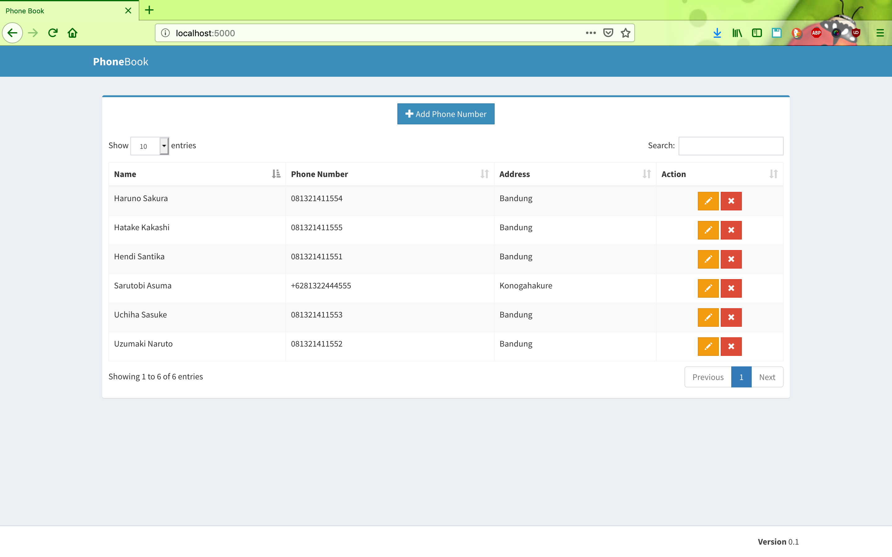
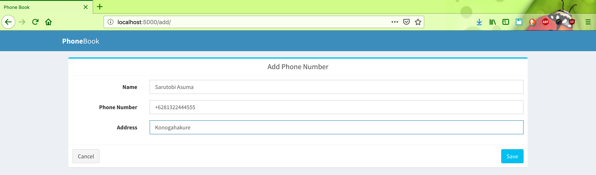
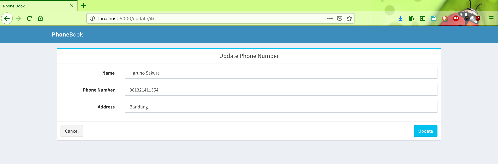

# flask-mysql-crud
A simple CRUD application using Flask and MySQL
#### Built With

    Python
    Python Libraries: flask and pymysql
    MySQL
    AdminLTE 2

#### Running server.py
```bash
python3.7 server.py
```

#### Screen shot

Open your favorite browser : http://localhost:5000 in browser.

Home Page



Add new Book



Update Book


